# 微信公众号爬虫

> 欢迎二次开发，提交PR 🎉

## 项目简介

利用python构建爬虫，爬取指定公众号历史文章及内容，同时支持利用关键词筛选文章。

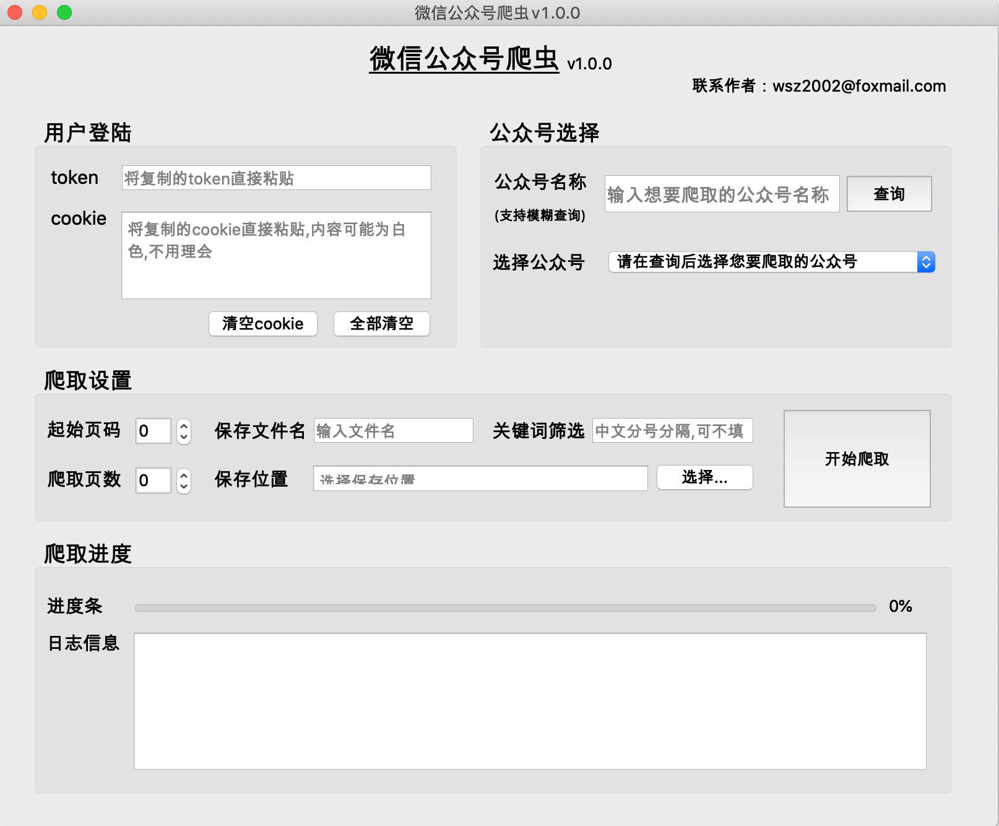

## 使用方法

### 获取token和cookie

##### 1、前往[微信公众平台](https://mp.weixin.qq.com/)登录或者注册公众号

##### 2、进入微信公众平台主界面，按快捷键`F12`打开如下界面，并切换到【网络】

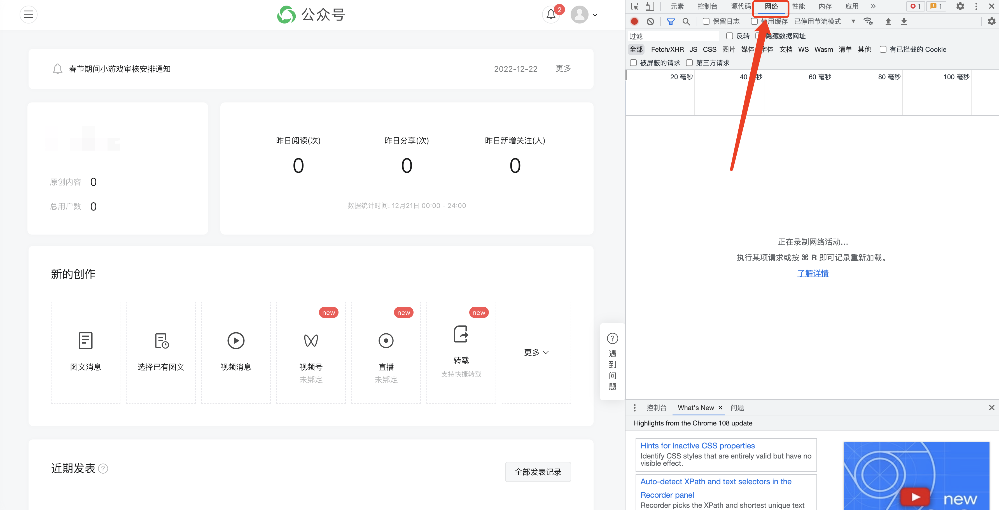

##### 3、刷新浏览器页面，点击查看图中指示的文件内容

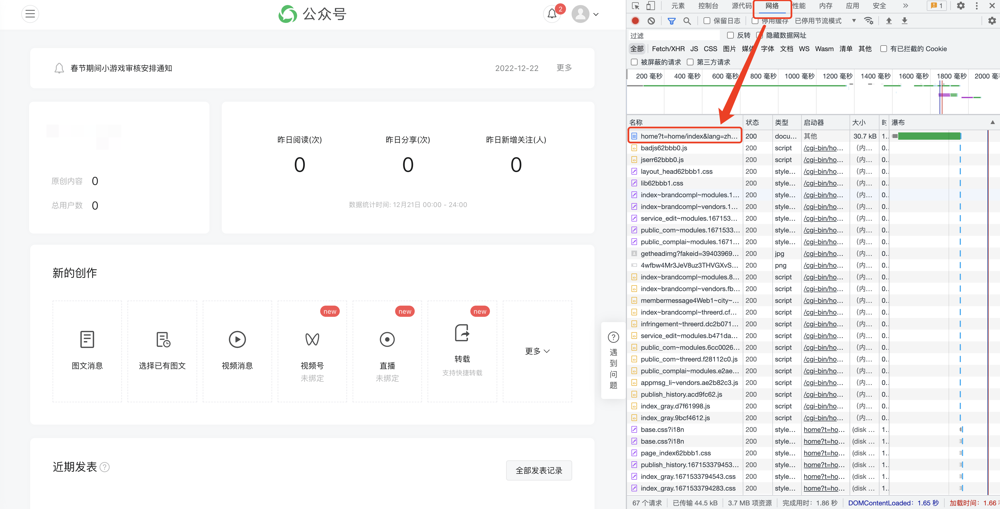

##### 4、在【载荷】中复制鼠标选中的内容，复制到爬虫程序的【token】中

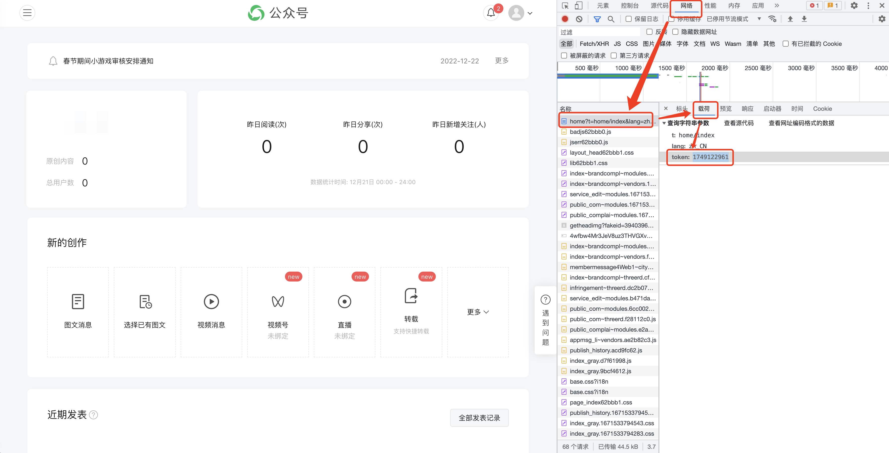

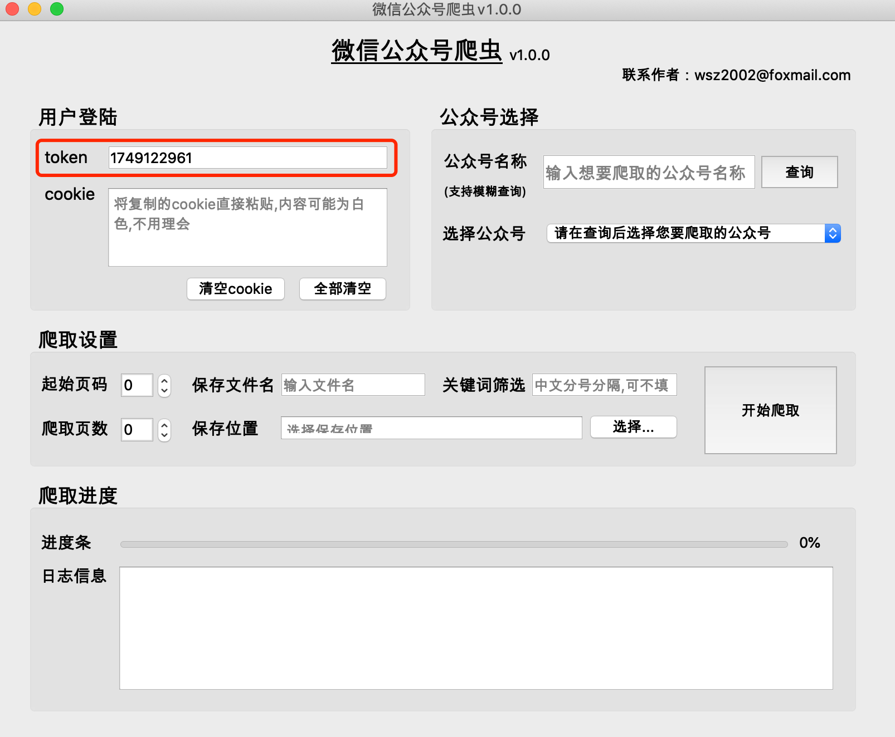

##### 5、在【标头】中找到【请求标头】，复制图中鼠标选中的所有内容，复制到爬虫程序的【cookie】中

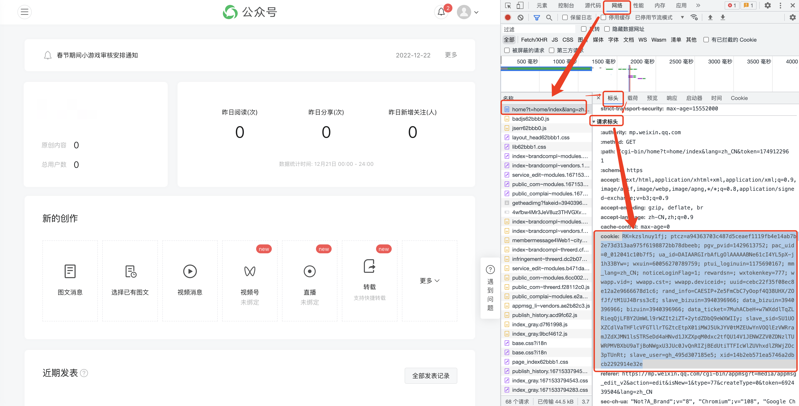

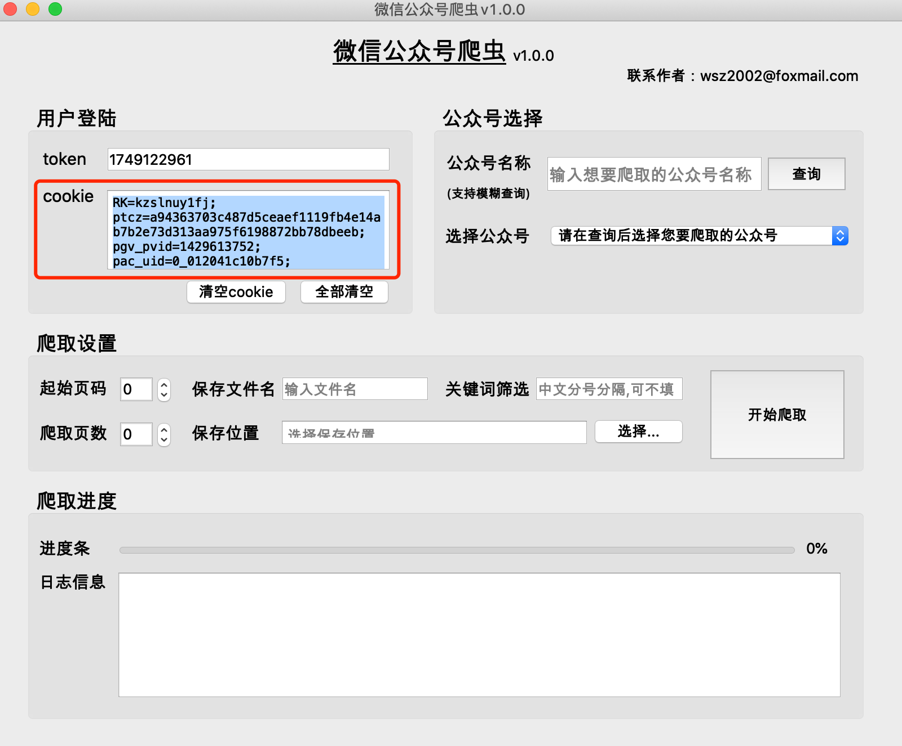

### 公众号选择

##### 1、在爬虫程序中输入想要爬取的公众号名称，点击【查询】按钮

##### 2、在下方【选择公众号】的查询结果中，选择想要爬取的公众号

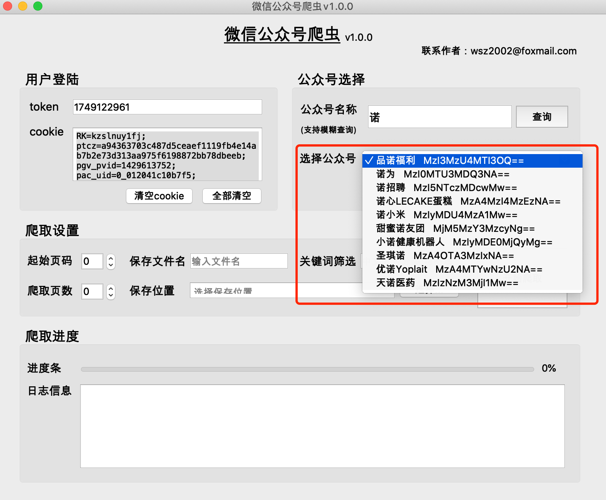

### 爬取设置

##### 1、起始页码 & 爬取页数

（1）公众号历史文章是分页获取的，一般一页有5-10篇文章

（2）公众号历史文章页数越小，时间越新，第0页存储的是最新文章

（3）推荐起始页码从0开始

（4）爬取页数不能为0，否则爬取结果为空

##### 2、保存文件名 & 保存位置

输入正确的文件名，选择文件位置即可

##### 3、关键词筛选（可填可不填）

（1）功能：用于根据关键词筛选文章，获取文章标题中包含关键词的文章。如果不填写，则获取所有文章。

（2）**格式：`关键词1；关键词2；关键词3`**

​		  用【中文分号】隔开，最后一个关键词后面不加分号

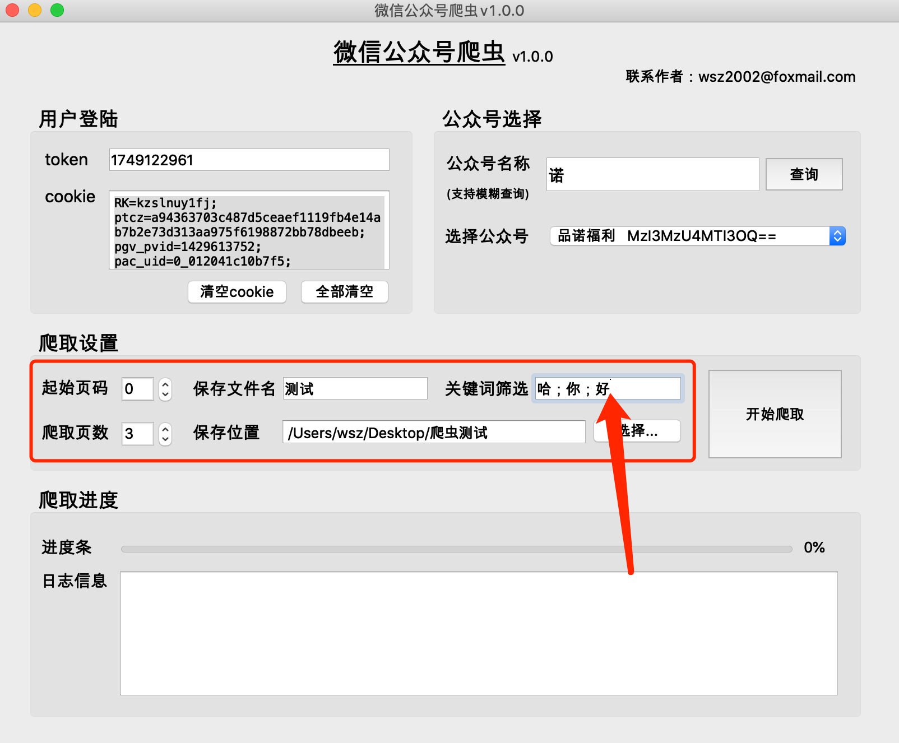

### 开始爬取 & 查看结果

##### 1、点击【开始爬取】按钮

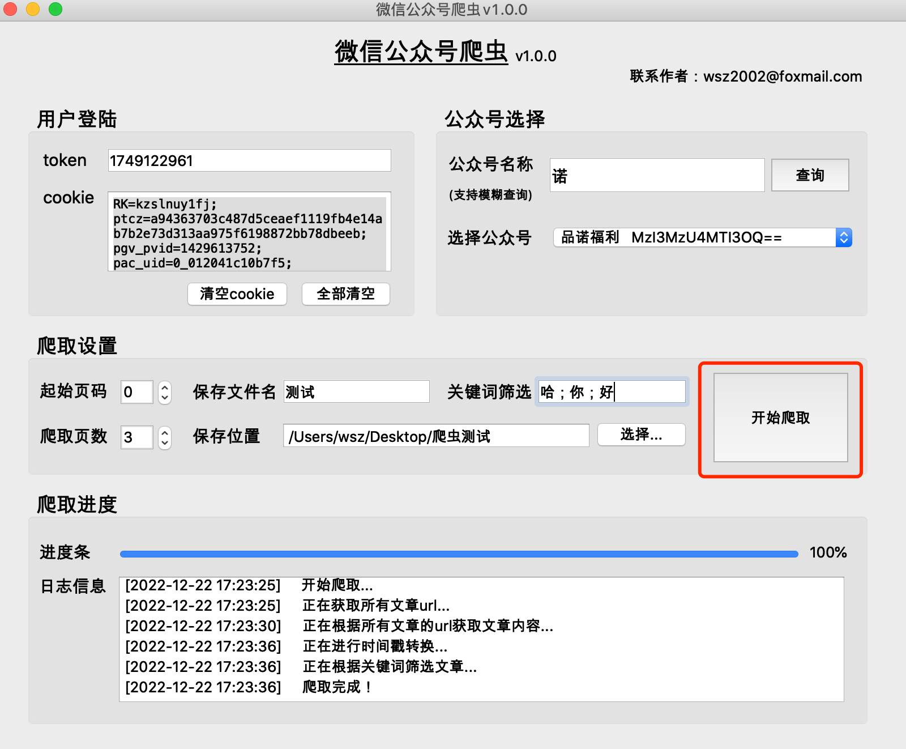

##### 2、查看爬取结果

（1）程序会在选择的文件保存位置目录下，生成一个`保存文件名_当日日期`的文件夹，并在该文件夹下保存爬取内容

（2）`raw`文件夹里的内容，是爬取过程中产生的缓存文件，可以删除

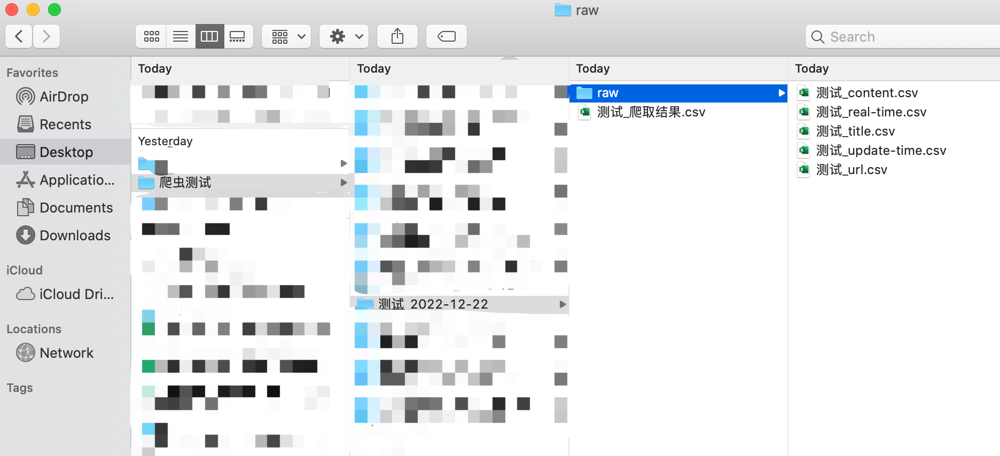
